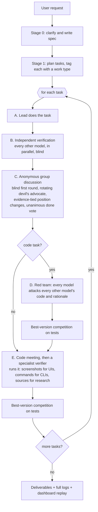
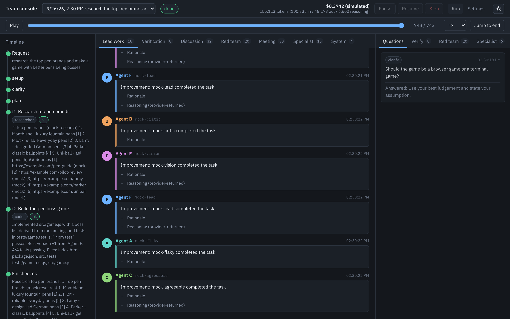

# multi-model-team

[](https://github.com/smartypants99/multi-model-team/actions/workflows/ci.yml)

**One slash command. Several frontier models from different companies verify, debate, red-team and improve Claude's work at every stage, until the result is finished and tested.**

Models from different providers catch different mistakes. A single model reviewing itself misses its own blind spots. `multi-model-team` puts Claude in the lead and surrounds it with models from OpenAI, xAI, Z.AI and Moonshot that check its work independently, argue about it anonymously, attack each other's code, and compete on real tests for the right to be called the best version.

```
/multi-model-team:team research the top pen brands and make a game with better pens being bosses
```

That is the whole interface. The engine clarifies, plans, does the work, verifies, debates, red-teams, runs the result, and hands you a tested deliverable plus a complete, readable log of who said what and why.

## How the pipeline works



**Anti-groupthink rules** are built into the discussion: models appear only as "Agent A/B/C" (never by name or provider), the first round is written blind, changing position requires a stated reason tied to evidence (a test result, a source, a line of code), one agent per round is assigned devil's advocate, and a discussion only ends when every model votes that it is done (with a rounds cap as a backstop).

**Tests decide.** After each code round, every model's sandbox is a candidate. A candidate is crowned only if it matches or beats the current best on every test the best was measured on. If the team changes the test suite, both sides are re-run on the new suite. Model opinions add context; tests decide.

## Key features

- **Five providers out of the box**: Anthropic (lead), OpenAI, xAI, Z.AI (GLM), Moonshot (Kimi). Clean adapter interface for adding more.
- **Nothing model-specific hard-coded**: keys are detected from the environment, endpoints are probed (Z.AI coding-plan vs general, China mirrors), models are discovered live from each provider's models endpoint, and capabilities (vision, tools, reasoning controls, context size) are detected from metadata or cheap cached probes.
- **Reasoning effort done right**: one common scale (`none/low/medium/high/xhigh/max`), but each provider gets its own native parameter, and you are only ever offered the levels a model actually supports.
- **Manual or auto per provider**: pick the exact model and effort, or let the lead pick and explain in one line. Mix freely; add two models from one provider.
- **Work types as an extension point**: researcher, coder, writing and planning ship today; add your own with a folder of prompts and a JSON file, no core changes.
- **Sandboxes**: each model edits only its own copy of the code (reads everyone's). Path jailing is enforced by the engine.
- **Safety**: resource guard sized to your real machine (RAM, disk, cores, GPU/unified memory), team vote on heavy commands, hard kill on runaway memory, timeouts on everything, user confirmation for destructive commands outside a sandbox, secrets redacted from every log.
- **Live dashboard**: chat-style view of the models talking, timeline, rationale and reasoning panels, verification results, red-team critiques, screenshots, diffs, best-version history, live cost, settings page. Replays any past run.
- **Offline mock mode**: the whole pipeline runs end to end with no keys and no cost.

## Supported work types and roadmap

| Work type | Status | What verification means |
|---|---|---|
| researcher | shipped | claims are checked against their sources; unsupported or conflicting claims flagged; coverage checked |
| coder | shipped | tests run in sandboxes, red-team rounds, visual verifier (screenshots) or execution verifier |
| writing | shipped | rubric review: accuracy, structure, clarity, audience fit, completeness |
| planning | shipped | rubric review: assumptions, risks, alternatives, actionable steps |
| data analysis | planned | needs a data execution harness and numeric-tolerance scoring |
| UI/visual design | planned | needs visual-regression and accessibility checks |
| maths/logic | planned | needs an executable proof/derivation checker |
| translation | planned | needs back-translation and terminology checks |

See `DESIGN.md` for the reasoning behind each judgement.

## Requirements

- Node.js 20 or newer (22 recommended) and npm
- git
- Claude Code, if you want the slash command (the CLI works without it)
- API keys for the providers you want on the team. The lead is Claude: either an Anthropic API key, or a logged-in Claude Code installation (the engine drives `claude -p` on your subscription when no key is set)
- Optional: Playwright's Chromium for screenshot-based visual verification (`npm i -D playwright && npx playwright install chromium`)

## Installation

The steps are the same on macOS, Windows and Linux.

```bash
git clone https://github.com/smartypants99/multi-model-team.git
cd multi-model-team
npm install
npm run build
```

On Windows use PowerShell or cmd; no bash scripts are involved anywhere.

## Installing the Claude Code plugin

The repository is its own plugin marketplace. Inside Claude Code:

```
/plugin marketplace add smartypants99/multi-model-team
/plugin install multi-model-team@multi-model-team
```

Or from your local clone:

```
/plugin marketplace add ./path/to/multi-model-team
/plugin install multi-model-team@multi-model-team
```

Then, inside the installed plugin folder, build the engine once (`npm install && npm run build`); the slash command tells you if this is missing. For a one-off session without installing: `claude --plugin-dir ./multi-model-team`.

The plugin adds:

- `/multi-model-team:team <request>` — the one slash command
- a PreToolUse hook that asks before Claude Code itself runs a destructive command outside the engine's sandboxes

Details: `docs/plugin.md`.

## Adding API keys

Copy `.env.example` to `.env` and fill in what you have:

```
ANTHROPIC_API_KEY=...
OPENAI_API_KEY=...
XAI_API_KEY=...
ZAI_API_KEY=...
MOONSHOT_API_KEY=...
SEARCH_API_KEY=...        # optional: web search for all models (provider set in config)
```

`.env` is git-ignored. Keys are never written to logs, the UI or sandboxes.

**No Anthropic API key?** If Claude Code is installed and logged in, the engine uses it as the lead automatically (`claude -p` with a local tool server, billed to your Claude subscription). Set `MMT_USE_CLAUDE_CLI=1` to prefer it even when a key exists. The engine does not guess a provider from the key's prefix; it probes the candidate endpoints and keeps the ones that answer. Check what was found with:

```bash
node dist/cli/main.js providers
```

A key that works nowhere is reported by name with the endpoints that were tried.

## Choosing models and reasoning effort

The first run asks, per detected provider: choose a model and reasoning effort, or let the lead pick. Choices are saved to `~/.multi-model-team/profile.json` and reused. You are asked again only when a saved model disappears from the provider's list, a new key appears, or you ask (`--reselect`).

Three ways to change selections:

1. **Dashboard settings page** — dropdowns built from the live model lists, showing vision, tool calling, context size and the reasoning levels each model supports.
2. **The profile file** — `~/.multi-model-team/profile.json`.
3. **Command arguments** for one run — `--model xai=grok-4.7:high --model openai=auto`.

Reasoning controls differ by model (effort levels, a thinking budget, on/off, or always on). The engine detects what each model supports and offers only that.

## Running it

**Slash command** (in Claude Code):

```
/multi-model-team:team build a CLI that converts CSV to Parquet with tests
```

**CLI**:

```bash
node dist/cli/main.js run --request "build a CLI that converts CSV to Parquet with tests"
node dist/cli/main.js serve          # dashboard only: replay runs, edit settings
node dist/cli/main.js providers      # what keys/models were detected
node dist/cli/main.js run --detach --request "..."   # background run; then:
node dist/cli/main.js wait <runId>   # block until finished or a question is pending
node dist/cli/main.js answer <runId> <questionId> "text"
node dist/cli/main.js stop <runId>   # also pause / resume
node dist/cli/main.js run --resume <runId>   # continue an interrupted run; finished tasks are not redone
node dist/cli/main.js run --request "..." --review plan,crown   # approve/amend the plan, accept or stop at each crowned version
node dist/cli/main.js --help
```

**Try it with no keys** (the mock provider runs the entire pipeline offline):

```bash
npm run demo
```

This writes the run into `runs/demo/` (git-ignored). A committed copy of the same run lives in `demo-run/` so you can browse the logs and replay it in the dashboard before adding any keys (`npm run demo:refresh` regenerates it).

**Check your setup** at any time with `npm run doctor`: it reports Node and git versions, detected providers and models, whether Claude Code is logged in, whether Playwright is available for screenshots, and the host resources the guard will use.

## The dashboard



`node dist/cli/main.js serve` starts it on `http://127.0.0.1:4310` (local only). The URL it prints carries a per-session access token (`?t=...`); open that exact URL, since the API refuses requests without it. This keeps other web pages, DNS rebinding and sandboxed model commands from driving your runs. It shows the live chat between agents, the stage and task timeline, each agent's rationale and any provider-returned reasoning, verification results, red-team critiques, verifier screenshots, sandbox diffs, best-version history with test scores, live token and cost totals, pause/stop controls, and the settings page.

## Reading the logs

Every run writes a folder with `events.jsonl` (machine-readable, the source of truth) and Markdown files for humans: spec, plan, team, per-task verification, discussion, red team, meeting, specialist actions and screenshots, diffs, test runs, best-version history, per-model rationales and calls, costs. `agents.json` maps "Agent B" to the real model (never shown to the models). See `docs/logs.md`.

## Safety features

- **Sandboxes**: one directory per model, outside the repository. A model may do anything inside its own sandbox, including deleting files, and can only read the others'. On macOS (`sandbox-exec`) and Linux with `bwrap` installed, every command a model runs is also confined by the operating system: it cannot write outside its sandbox and cannot read your `.env`, `~/.ssh`, `~/.aws`, GitHub CLI or browser credentials. `npm run doctor` tells you whether that layer is active on your machine.
- **Destructive-command confirmation**: anything destructive that could touch files outside a sandbox (absolute paths, `..`, `sudo`, global uninstalls, system settings) pauses the run and asks you. The Claude Code hook applies the same rule to Claude Code's own commands.
- **Without an OS sandbox** (Windows, or Linux without `bwrap`): the command classifier runs in strict mode. Any command that references a location outside the sandbox, uses shell expansion or an inline interpreter the classifier cannot inspect (`$HOME`, `$(...)`, `eval`, `sh -c`, `python -c`, `node -e`, `xargs`, `find -exec`), or could send data out or persist beyond the run (`curl -d`, `nc`, `ssh`, `crontab`, `| sh`) asks for your confirmation. Expect more prompts on such hosts; that is the trade-off for not having an OS-level boundary.
- **Unattended runs**: when nobody can answer (stdin is not a terminal and no dashboard is open, or `MMT_UNATTENDED=1` for detached runs) the engine takes the safe answer: destructive commands are denied, the cost cap stops the run, model selection goes to auto, and clarifications get "use your best judgement". Nothing is ever auto-approved.
- **Resource guard**: the engine measures your real RAM, free disk, cores and GPU/unified memory. Heavy commands must carry a resource estimate; every model votes on it; the engine blocks anything above a safe fraction (60 % by default) and kills processes that exceed their memory limit. Every command has a timeout, and sandboxed commands never see your API keys.

## Cost warning

Multi-model debates use a lot of API credit. A single task can involve dozens of calls across four or five paid providers, at high reasoning effort. For scale: with two cheap models at low effort, a haiku cost about $0.12 and a tiny tested library about $0.40; a real feature with five flagship models at high effort can cost tens of dollars. Set a cap:

```json
// config.local.json
{ "cost": { "capUsd": 5 } }
```

or `MMT_COST_CAP_USD=5`, or `--cost-cap 5`. When the cap is reached the run pauses and asks whether to continue. Live totals are in the dashboard and in `costs.md`.

## Adding a new work type

Create `work-types/<name>/worktype.json` and the prompt files it references, or put the folder anywhere and list its parent in `config.workTypes.extraDirs`. No core code changes are needed. `work-types/example-minimal/` is the smallest valid work type; `docs/work-types.md` documents every field, placeholder and the JSON reply shapes.

## Troubleshooting

- **"No providers detected"**: check `.env` and run `node dist/cli/main.js providers`. Keys are probed against every candidate endpoint; a key that answers nowhere is listed with what was tried.
- **Z.AI key rejected**: coding-plan keys only work on the coding endpoint. The models list answers everywhere, so the engine probes each endpoint with a real one-token completion and keeps only the ones that accept the key.
- **Claude Code lead says "Not logged in"**: run `claude` once interactively and log in; the engine calls `claude -p` without `--bare` so it can use the stored login.
- **The slash command says the engine is not built**: run `npm install && npm run build` in the plugin folder.
- **Screenshots say Playwright is unavailable**: install it in the environment the engine runs in; until then visual verification falls back to execution verification.
- **Windows**: use PowerShell or cmd; paths with spaces are fine. If `node` is not found by the hook, make sure it is on the PATH used by Claude Code.
- **A model keeps failing**: it is disabled for the run with a logged reason; the run continues while at least two models remain.
- **The run was interrupted** (network outage, machine slept, process killed): `node dist/cli/main.js run --resume <runId>` picks up from the last checkpoint, skipping the spec, plan and every task that already finished.

## Contributing

Issues and pull requests are welcome. Run `npm test` (everything runs on the mock provider, no keys needed), `npm run build` and `npm run scan-secrets` before opening a PR. CI runs the suite on macOS, Windows and Linux. `node scripts/install-git-hooks.mjs` installs a pre-commit secret scan.

## License

MIT. See `LICENSE`.
